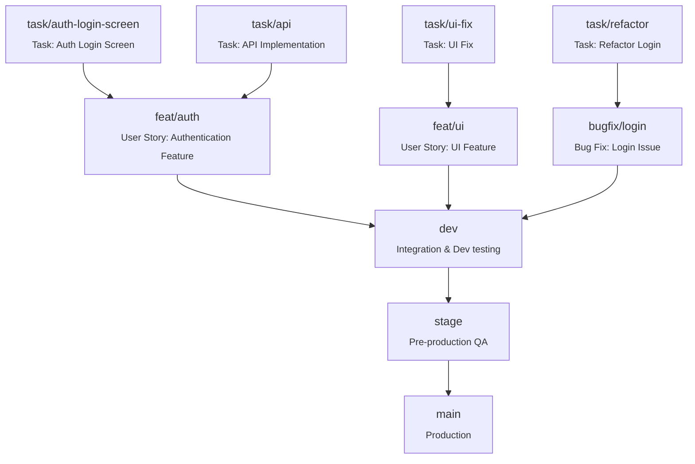
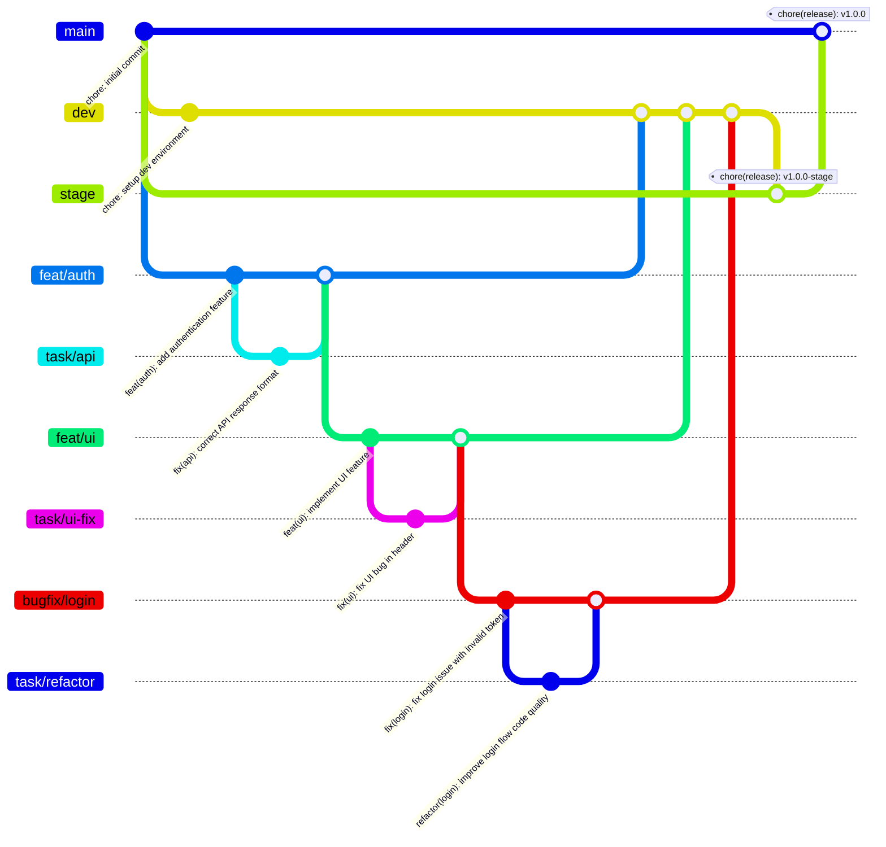

# Git Branching & Release Strategy

This document describes the branching, merging, and release strategy for the **Realworld** project.  
It is designed to ensure:
- **Clean and traceable commit history**
- **Reliable changelog generation**
- **Smooth deployments** across environments (Dev, Stage, Prod)
- Alignment with **Agile** workflows

---

## Branch Structure

We use **long-lived environment branches** and **short-lived feature branches**.

### Permanent Branches
| Branch  | Purpose                                                                  | Deployment Target |
|---------|--------------------------------------------------------------------------|-------------------|
| `main`  | Production-ready code. Contains only tested, approved features.          | **Prod**          |
| `stage` | Pre-production environment for final QA. Mirrors `main` before releases. | **Stage**         |
| `dev`   | Integration environment where features are tested together.              | **Dev**           |

---

### Temporary Branches
| Branch Prefix | Purpose                                                                                     |
|---------------|---------------------------------------------------------------------------------------------|
| `feat/*`      | A full **user story** or large feature. Merges into `dev`.                                  |
| `task/*`      | A smaller sub-task within a feature. Merges into a `feat/*` branch.                         |
| `bugfix/*`    | Fixes for non-critical issues. Merges into `dev`.                                           |
| `hotfix/*`    | Critical fixes for production. Merges into both `main` and `stage` (and `dev` if relevant). |

---

## Merge Rules

We enforce **different merge styles** depending on the branch direction:

| From → To           | Merge Type                                           | Reason                                                         |
|---------------------|------------------------------------------------------|----------------------------------------------------------------|
| `task/*` → `feat/*` | **Squash**                                           | Keeps feature branch history clean.                            |
| `feat/*` → `dev`    | **Squash**                                           | One commit per feature → easier review and revert.             |
| `dev` → `stage`     | **Merge commit**                                     | Preserves individual feature commits for changelog generation. |
| `stage` → `main`    | **Merge commit**                                     | Ensures changelog includes all feature commit messages.        |
| `hotfix/*` → `main` | **Squash** or **merge commit** depending on urgency. |

---

## Commit Message & PR Title Rules

We follow the **[Conventional Commits](https://www.conventionalcommits.org/)** standard:

```
<type>(<scope>): <short summary>
```

**Examples:**
```
feat(auth): add refresh token support
fix(ui): correct navbar alignment
docs(readme): update setup instructions
```

**Allowed types:**
- `feat` – New feature
- `fix` – Bug fix
- `docs` – Documentation change
- `style` – Code style (no logic changes)
- `refactor` – Code restructuring
- `perf` – Performance improvement
- `test` – Testing changes
- `chore` – Maintenance tasks

**Why?**
- PR titles are **used for squash commits**.
- Changelogs are **generated from commit messages**.

---

## Pull Request Guidelines
1. **Target the correct branch:**
    - `feat/*` → `dev`
    - `task/*` → `feat/*`
    - `bugfix/*` → `dev`
    - `hotfix/*` → `main` (and `stage`/`dev` if needed)
2. **PR title** must follow Conventional Commits.
3. Keep PRs small and focused on a single scope.
4. Request at least **one reviewer**.
5. Pass **all checks** (lint, tests, build) before merging.

---

## Release Flow

### Development Cycle
1. Developers work in `task/*` or `feat/*` branches.
2. Merge features into `dev` (via squash merge).
3. Deploy `dev` branch automatically to the Dev environment.

### Staging Release
1. Merge `dev` → `stage` (merge commit).
2. Deploy `stage` branch to the Stage environment.
3. Run final QA.

### Production Release
1. Merge `stage` → `main` (merge commit).
2. Tag the release using `release-it` (see below).
3. Deploy to production.

---

## Changelog & Tagging

We use **release-it** with **@release-it-plugins/lerna-changelog** to:
- Generate changelogs from commit history
- Tag releases automatically
- Publish to GitHub Releases

**Tag format:**
- Production: `v1.2.3`
- Stage: `v1.2.3-stage`
- Dev: *(no tags — auto-deploy only)*

---

## Example Workflow
```
feat/auth-login  → (squash) → dev
dev              → (merge commit) → stage
stage            → (merge commit) → main → tag & release
```

**Hotfix example:**
```
hotfix/urgent-logout-bug → main (+ stage, dev)
```

---

## Branch Protections
We enforce the following in GitHub branch settings:
- **Require PR reviews** before merging.
- **Require status checks** to pass.
- **Restrict who can push** to `main`, `stage`, and `dev`.
- **Disallow direct commits** to permanent branches.

## Flowchart of Branching Strategy



## Git Graph


