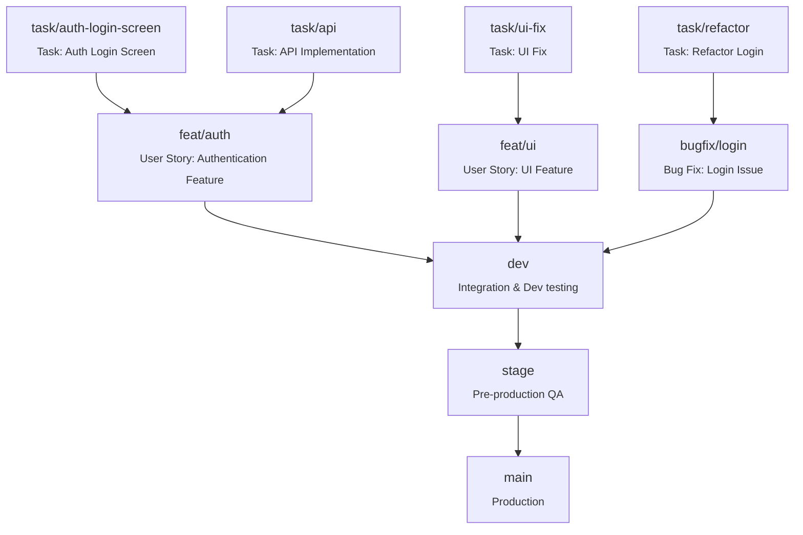
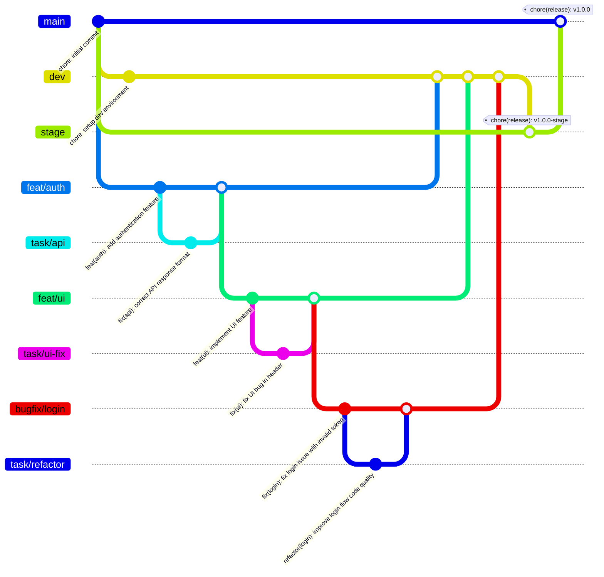

# Git Branching & Release Strategy Overview

This documentation provides an in-depth guide to the **Git branching, merging, and release workflow** used in the Realworld project.  
Our approach is carefully designed to achieve the following goals:

- **Maintain a clean and traceable commit history**, ensuring every change can be traced to a task or feature.
- **Automate changelog generation** based on commit messages, reducing manual overhead.
- **Facilitate reliable and predictable deployments** across multiple environments: Development, Staging, and Production.
- **Align Git workflows with Agile principles**, reflecting how user stories and tasks are handled in branches.
- **Ensure team collaboration and code quality** through enforced PR reviews and commit standards.

This overview introduces the high-level concepts.  
Subsequent pages will cover branch definitions, merging rules, commit guidelines, release flow, and tooling.

For a visual summary of the branching strategy, see the **Flowchart of Branching Strategy** below.

## Git Graph

